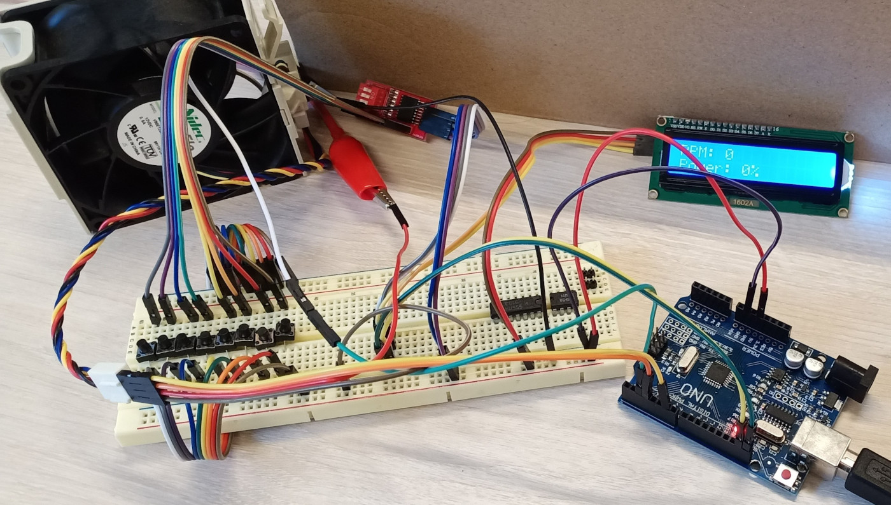
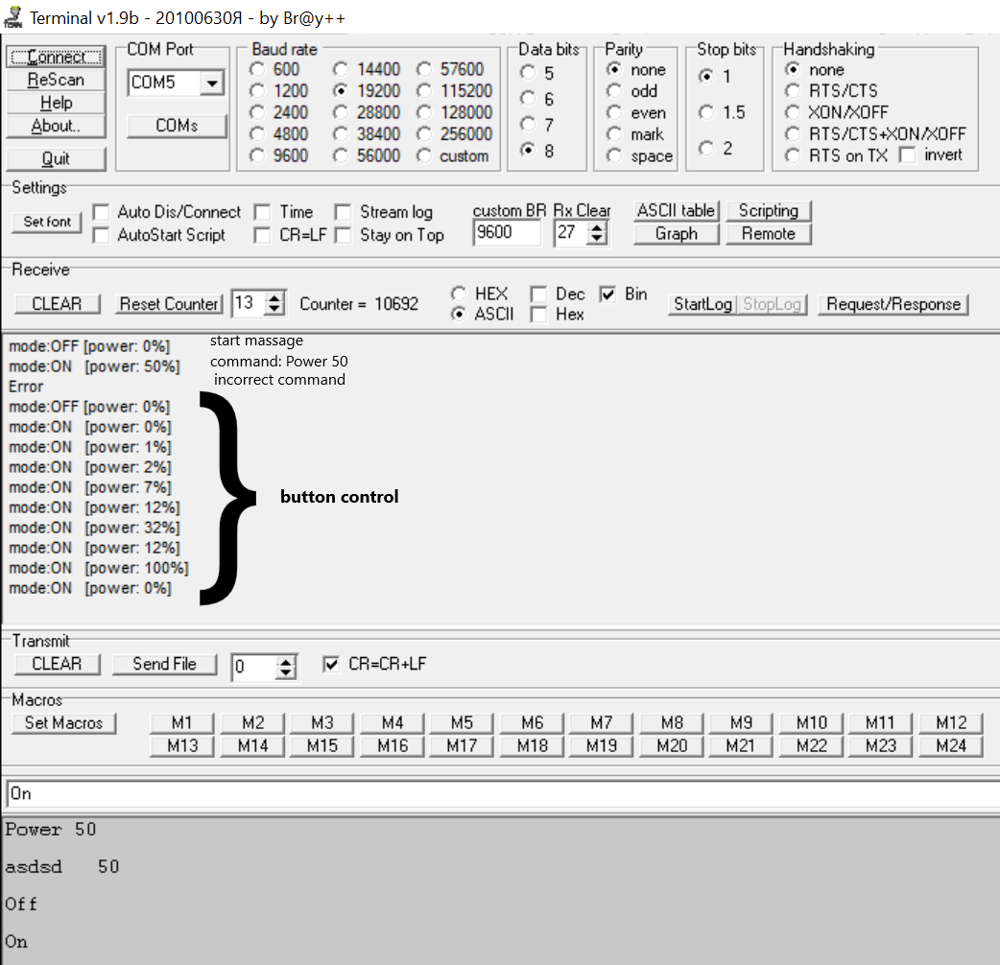
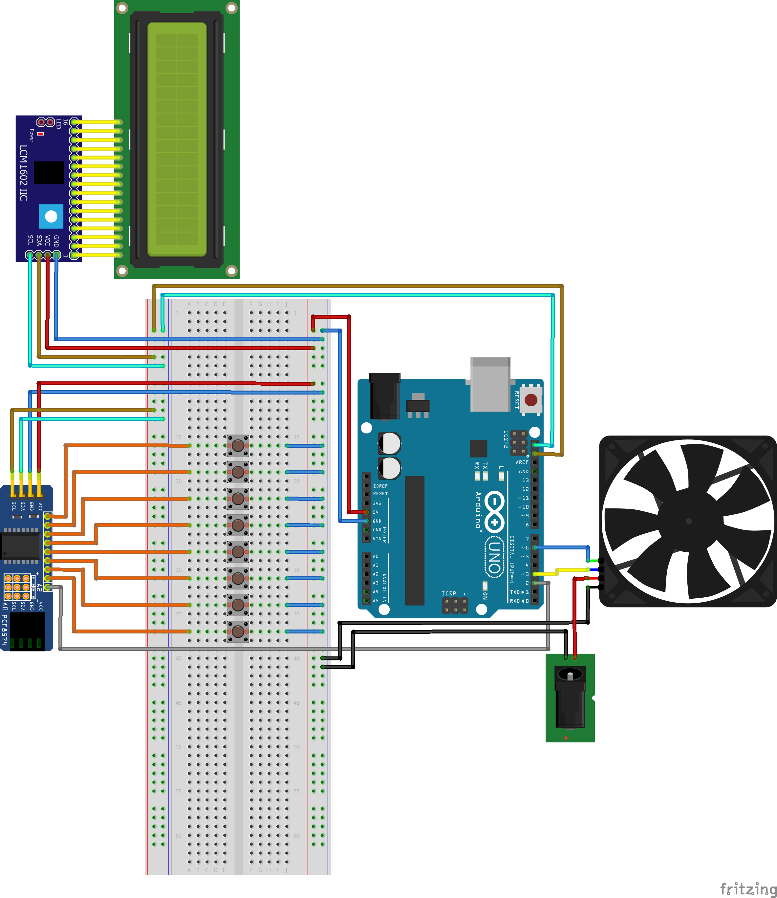

## Управление вентиляторами с микроконтроллера Atmega328

Устройство реализовано на базе платы **Arduino uno** компилятор **Avr-gcc**.

Для управления вентиляторами комманды передаются через СОМ-порт (стандартный интерфейс, распаянный на плате). Скорость 19200 8n1.

Команды:
On (включить вентилятор на полную мощность)
Off (выключить вентилятор)
Power 20 (устанавливает мощность 20% от максимальной).
Led Display возвращает обороты вентилятора в минуту, мощность.
мощность также можно менять с помощью 8 кнопок:
1 кнопка: увеличить мощность на 1
2 кнопка: уменьшить мощность на 1
3 кнопка: увеличить мощность на 5
4 кнопка: уменьшить мощность на 5
5 кнопка: увеличить мощность на 20
6 кнопка: уменьшить мощность на 20
7 кнопка: установить мощность 100
8 кнопка: установить мощность 0

